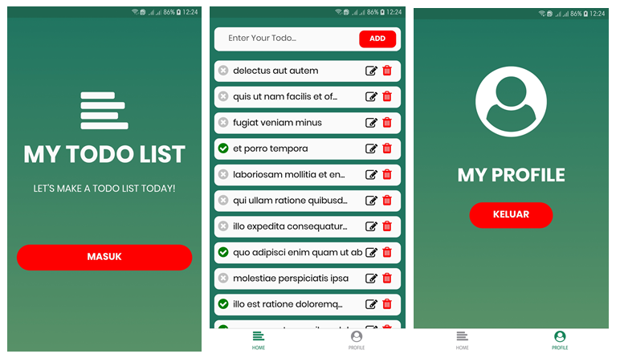

# RLI Todolist App

This is a Test from PT. Rajawali Lestari Inovasi, where I built a mobile application called todolist application.

## Table of Contents

- [Screenshots](#screenshots)
- [Built With](#built-with)
- [Author](#author)

## Screenshots

## Built With

- [React Native](https://facebook.github.io/react-native/) - Front-end
- [Redux Thunk](https://redux.js.org/) - State Management
- [JSON Placeholder](https://jsonplaceholder.typicode.com/) - API

## Author

**Nur Muhamad Rum** - [https://github.com/nurmuhamadrum](https://github.com/nurmuhamadrum)
